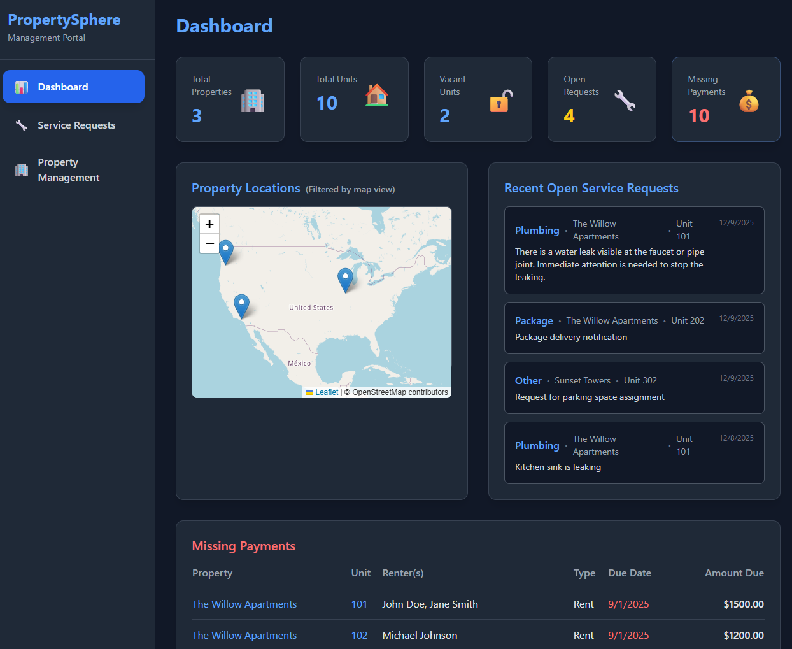
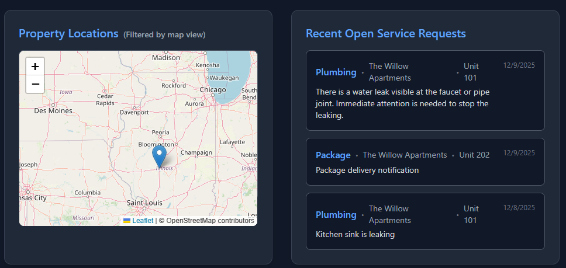

# PropertySphere 🏠

**PropertySphere** is a modern Property Management System built with **Python (FastAPI)** and **RavenDB**. It demonstrates how to leverage RavenDB's advanced features—including **GenAI integration**, **AI Agents**, **Spatial Indexing**, **Dynamic Indexing** and **Data Subscriptions**—to build intelligent, real-time applications.



Here is an example of the Telegram Bot that integrate into this application

> ### 🤖 Chat With Your Property Bot
> **Talk to:** `$YOUR_BOT_ID` on Telegram (replace with your bot’s handle). Try prompts like:
> - "What were my utility charges last month?"
> - "What’s my balance right now?"
> - "Can you charge my card for pending rent?"
> - "I need maintenance to fix a leaky faucet."
>   - Add a photo for context (e.g., [`plumbing-problem-pic.jpg`](plumbing-problem-pic.jpg))
> - "Any open service requests still pending?"
>
> The bot can pull your balances, charge your saved card, open and track service requests, and even process any photos you send. Pair these with the screenshots below to see the experience.

## 🚀 Core Features

*   **AI-Powered Renter Assistant:** A Telegram bot that acts as a property agent, allowing renters to report issues, check balances, and pay rent using natural language.
*   **Intelligent Maintenance:** Upload a photo of a maintenance issue (e.g., a leaking pipe), and the system automatically analyzes it using GenAI to generate a technical description for the maintenance team.

*   **Billing:** Renters can inquire about their bill, pay it, etc. All with a friendly and interactive bot to guide them.

*   **Real-time Notifications:** Uses RavenDB Subscriptions to react immediately when a photo is analyzed, notifying the user back on Telegram.
*   **Location-Aware:** Spatial indexes allow for querying properties and service requests by location.
*   **Financial Tracking:** Tracks debt items, payments, and utility usage.

## 🛠️ Prerequisites

Before you begin, ensure you have the following:

1.  **Python 3.10+** installed.
2.  **RavenDB 7.1+** running.
    *   [Installation & Setup Guide](https://docs.ravendb.net/7.1/start/getting-started#installation--setup)
    *   You can run it locally or use RavenDB Cloud.
3.  **OpenAI API Key**: Required for the AI features.
    *   [Get your API Key](https://platform.openai.com/api-keys)
4.  **Telegram Bot Token**: Required for the chat interface.
    *   Open Telegram and chat with [@BotFather](https://t.me/BotFather).
    *   Send `/newbot` and follow the instructions to get your token.

## ⚙️ Setup Guide

### 1. Database Setup
1.  Open your RavenDB Studio (usually `http://localhost:8080`).
2.  Create a new database named `PropertySphere`.
    *   [Create New Database Guide](https://docs.ravendb.net/6.0/studio/database/create-new-database/general-flow)

### 2. Environment Configuration
Create a `.env` file in the root directory of the project. You can copy the structure from `config.py` or use the following template:

```ini
# RavenDB Connection
RAVENDB_URL=http://localhost:8080
RAVENDB_DATABASE=PropertySphere

# AI Configuration (OpenAI)
AI_PROVIDER=OpenAI
AI_MODEL=gpt-4.1-mini
AI_API_KEY=sk-proj-...  <-- Your OpenAI Key

# Telegram Configuration
TELEGRAM_BOT_TOKEN=123456:ABC-DEF... <-- Your Telegram Bot Token
```

### 3. Installation
Install the required Python dependencies:

```bash
pip install -r requirements.txt
```

## 🏃 Running the Application

You can run the application using the VS Code Tasks or directly via the terminal.

### Option A: VS Code Tasks (Recommended)
1.  Open the Command Palette (`Ctrl+Shift+P`).
2.  Select **Tasks: Run Task**.
3.  Choose **Run PropertySphere** (starts the app) or **Watch PropertySphere** (starts with hot-reloading).

### Option B: Terminal
```bash
python main.py
```
*Or for hot-reloading:*
```bash
uvicorn main:app --reload
```

## 🧪 Generating Demo Data

To see the app in action, you need data. We have a built-in data generator that sets up properties, units, leases, and links a renter to your Telegram account.

1.  **Get your Telegram Chat ID**:
    *   Start a chat with [@userinfobot](https://t.me/userinfobot) on Telegram.
    *   It will reply with your ID (e.g., `123456789`).
2.  **Run the Generator Task**:
    *   In VS Code, run the task **Generate Demo Data**.
    *   Enter your **Telegram Chat ID** when prompted.
    *   *Alternatively, make a POST request:*
        ```bash
        curl -X POST "http://localhost:8000/api/datageneration/generate-data?telegram_chat_id=YOUR_CHAT_ID"
        ```

Once generated, you can start chatting with your bot! Try saying *"Hello"* or *"I have a leak in my kitchen"*.

## 🧠 RavenDB Features & Architecture

This project highlights several powerful RavenDB capabilities:

### 1. AI Agent (`PropertyAgent`)
We configure a **RavenDB AI Agent** that lives directly in the database. It uses RAG (Retrieval-Augmented Generation) to answer renter questions based on the data stored in RavenDB (leases, debts, etc.).

*   **Code:** `services/property_agent.py`
*   **Flow:** The Telegram bot sends user messages to the RavenDB Agent, which processes them using the configured LLM and retrieves relevant documents to formulate a response.

### 2. GenAI ETL (`PropertyDescriptionGenerator`)
When a user uploads a photo to Telegram, we store it as an **Attachment** in RavenDB. We then use a **GenAI Task** to automatically process this image.

*   **Code:** `services/property_description_generator.py`
*   **Mechanism:**
    *   A `GenAiConfiguration` is defined with a prompt for the AI (e.g., "Describe this maintenance issue").
    *   RavenDB sends the image to OpenAI.
    *   The result is written back to the document's `Description` field.

### 3. Data Subscriptions (`PhotoSubscription`)
We use **RavenDB Subscriptions** to trigger actions *after* data has been modified.

*   **Code:** `services/photo_subscription.py`
*   **Flow:**
    1.  The GenAI task updates the document with a description.
    2.  The Subscription listens for documents where `Description != null`.
    3.  It triggers a notification back to the user via Telegram: *"I have created a plumbing service request for the leak you reported..."*

### 4. Spatial Indexing
We use RavenDB's spatial capabilities to index properties and service requests by location.



*   **Code:** `indexes.py`
*   **Example:** `ServiceRequests_ByStatusAndLocation` allows querying for open requests within a specific radius of a property manager.

```python
# Example Index Definition
class ServiceRequests_ByStatusAndLocation(AbstractIndexCreationTask):
    def __init__(self):
        super(ServiceRequests_ByStatusAndLocation, self).__init__()
        self.map = """
        from sr in docs.ServiceRequests
        let property = LoadDocument(sr.PropertyId, "Properties")
        select new {
            Location = CreateSpatialField(property.Latitude, property.Longitude)
        }
        """
```

### 5. Time Series Data
We use **RavenDB Time Series** to efficiently store and query utility usage data (Water, Electricity) for each unit.


*   **Code:** `routers/utility_usage.py`
*   **Usage:** Storing hourly/daily consumption data and querying it for graphs and billing.

## 📸 Gallery

<div align="center">
  
  <br/><br/>
  
  
  <br/><br/>
  
  
</div>
