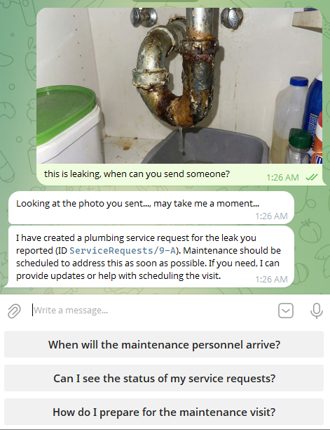
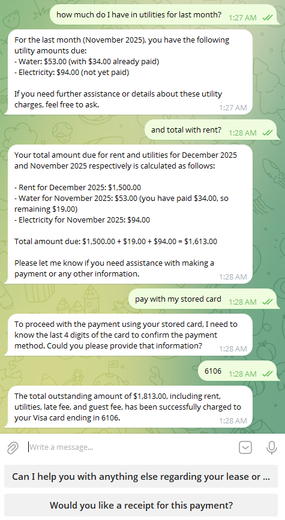
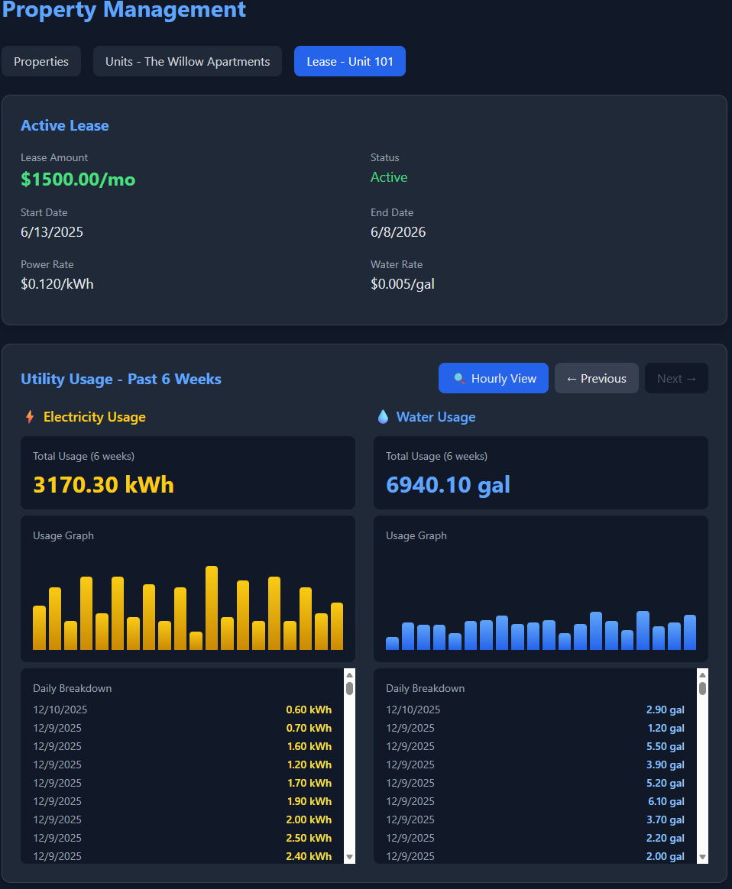

# PropertySphere 🏠

PropertySphere is a modern Property Management System built with ASP.NET Core, RavenDB, and a lightweight React frontend. It demonstrates RavenDB’s advanced features — GenAI integration, AI Agents, Spatial Indexing, Dynamic Indexing, Data Subscriptions, and Time Series — to deliver an intelligent, real‑time experience for renters and property managers.


### 🤖 Chat With Your Property Bot

Talk to your Telegram bot (replace with your bot’s handle). Try prompts like:

- "What were my utility charges last month?"
- "What’s my balance right now?"
- "Can you charge my card for pending rent?"
- "I need maintenance to fix a leaky faucet." (you can attach a JPG)
- "Any open service requests still pending?"

The bot can show balances, accept payments, open and track service requests, and react to photo uploads.

## 🚀 Core Features

- **AI‑Powered Renter Assistant**: Telegram bot that lets renters report issues, check balances, and pay rent with natural language.
- **Intelligent Maintenance (GenAI)**: Upload a photo (JPG) and a GenAI ETL generates a concise, actionable description for maintenance.

   

- **Billing**: Friendly flow for reviewing and paying outstanding debt items.

   
   
- **Real‑time Notifications**: RavenDB Subscriptions notify renters on analysis results and workflow updates.
- **Location‑Aware**: Spatial indexes enable querying by property/service-request locations.
- **Financial Tracking**: Debt items, payments, and utility usage with allocations.

## 🛠️ Prerequisites

1. **.NET 8 SDK**
2. **RavenDB 7.1+** (local or RavenDB Cloud)
    - Getting started: https://docs.ravendb.net/7.1/start/getting-started#installation--setup
3. **OpenAI API Key** (required for AI features)
4. **Telegram Bot Token** (required for chat interface)
    - Create a bot via [@BotFather](https://t.me/BotFather) → `/newbot`

## ⚙️ Setup Guide

### 1) Database Setup

1. Open RavenDB Studio (usually http://localhost:8080).
2. Create a database named `PropertySphere`.

### 2) Environment Configuration

Use `appsettings.Development.json` (recommended for local dev):

```json
{
   "RavenDb": {
      "Url": "http://localhost:8080",
      "Database": "PropertySphere"
   },
   "Telegram": {
      "BotToken": "YOUR_TELEGRAM_BOT_TOKEN_HERE"
   },
   "AI_API_KEY": "YOUR_OPENAI_API_KEY_HERE"
}
```

Alternatively, set environment variables (PowerShell):

```powershell
$env:AI_API_KEY = "sk-proj-..."             # OpenAI key (enables AI Agent & GenAI)
$env:Telegram__BotToken = "123456:ABC-DEF"  # Telegram bot token (note: double underscore)
```

> Notes
> - If `AI_API_KEY` is not set, AI Agent and GenAI tasks are skipped.
> - If `Telegram:BotToken` is missing, the app runs but the Telegram polling service stays disabled.

Or use .NET User Secrets (recommended for local dev):

```powershell
# Run in the project folder (contains PropertySphere.csproj)
dotnet user-secrets set "AI_API_KEY" "sk-proj-..."
dotnet user-secrets set "Telegram:BotToken" "123456:ABC-DEF"
```

User Secrets are loaded automatically in Development (see `Properties/launchSettings.json`) because this project already defines a `UserSecretsId` in `PropertySphere.csproj`.

### 3) Installation

```powershell
dotnet restore
```

## 🏃 Running the Application

### Option A: VS Code Tasks (recommended)
1. Open Command Palette → “Tasks: Run Task”.
2. Choose **Run PropertySphere** (or **Watch PropertySphere** for hot reload).

### Option B: Terminal

```powershell
dotnet run --project .\PropertySphere.csproj

# Hot reload
dotnet watch run --project .\PropertySphere.csproj
```

App URL: http://localhost:5000 (serves the React frontend from `wwwroot/`).

## 🧪 Generating Demo Data

To explore the app with realistic data and link your Telegram account:

1. Get your Telegram Chat ID: chat with [@userinfobot](https://t.me/userinfobot) and copy the numeric ID.
2. Use the VS Code task **Generate Demo Data** (you’ll be prompted for the Chat ID), or run:

```powershell
Invoke-RestMethod -Uri "http://localhost:5000/api/datageneration/generate-data?telegramChatId=YOUR_CHAT_ID" -Method POST

# curl alternative
curl -X POST "http://localhost:5000/api/datageneration/generate-data?telegramChatId=YOUR_CHAT_ID"
```

Once generated, start chatting with your bot. Try “Hello” or “I have a leak in my kitchen”.

## 🧠 RavenDB Features & Architecture

### 1) AI Agent (`PropertyAgent`)

We configure a RavenDB AI Agent to answer renter questions using RAG over your RavenDB data (leases, debts, payments, utilities): looks up relevant documents, formats helpful responses, and exposes tool actions like creating service requests or charging a stored card.

- Code: `services/PropertyAgent.cs`
- Flow: Telegram → RavenDB Agent → Queries/Actions → Reply + follow‑ups

### 2) GenAI ETL (`PropertyDescriptionGenerator`)

When a renter uploads a JPG via Telegram, the image is stored as an attachment on a `Photo` document. A GenAI task processes it and writes a concise description back to the document.

- Code: `services/PropertyDescriptionGenerator.cs`
- Mechanism: `GenAiConfiguration` + prompt → OpenAI model → updates `Description`

### 3) Data Subscriptions (`PhotoSubscription`)

Subscriptions react after the GenAI description is saved, notifying the renter via Telegram with context.

- Code: `services/PhotoSubscription.cs`
- Query: all `Photos` where `Description != null`

### 4) Spatial Indexing

We index service requests with geospatial fields for property‑centric queries.

- Code: `Indexes/ServiceRequests_ByStatusAndLocation.cs`
- Example (C#):

```csharp
Map = requests => from sr in requests
                  let property = LoadDocument<Property>(sr.PropertyId)
                  select new {
                        Location = CreateSpatialField(property.Latitude, property.Longitude)
                  };
```

### 5) Time Series Data

Utility usage (Water, Power) for each unit is stored as RavenDB Time Series and queried for billing and graphs.

- Ingest: demo generator writes hourly usage
- Query: AI Agent can request time‑bounded aggregations for renter units

## 📸 Gallery

<div align="center">
   
   <br/><br/>
   
   
   <br/><br/>
   
   
   <br/>
</div>

## 📎 Additional Links

- Quickstart: `QUICKSTART.md`
- Overview: `SUMMARY.md`
